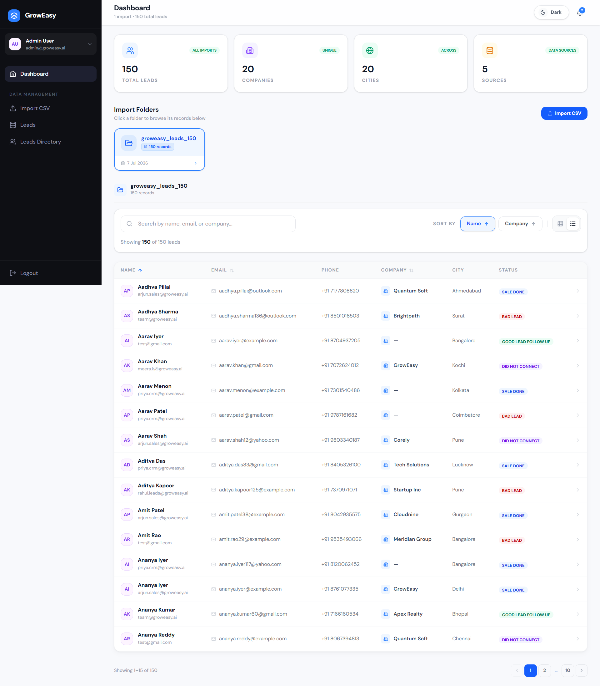
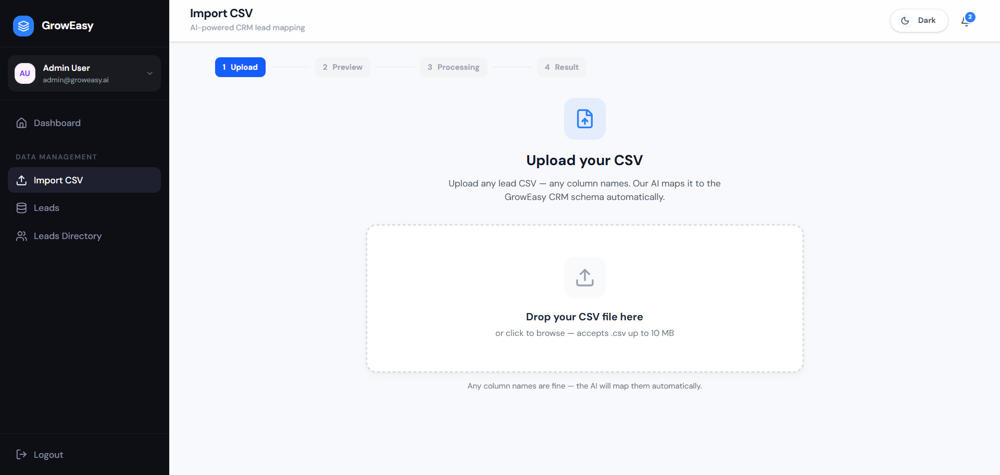
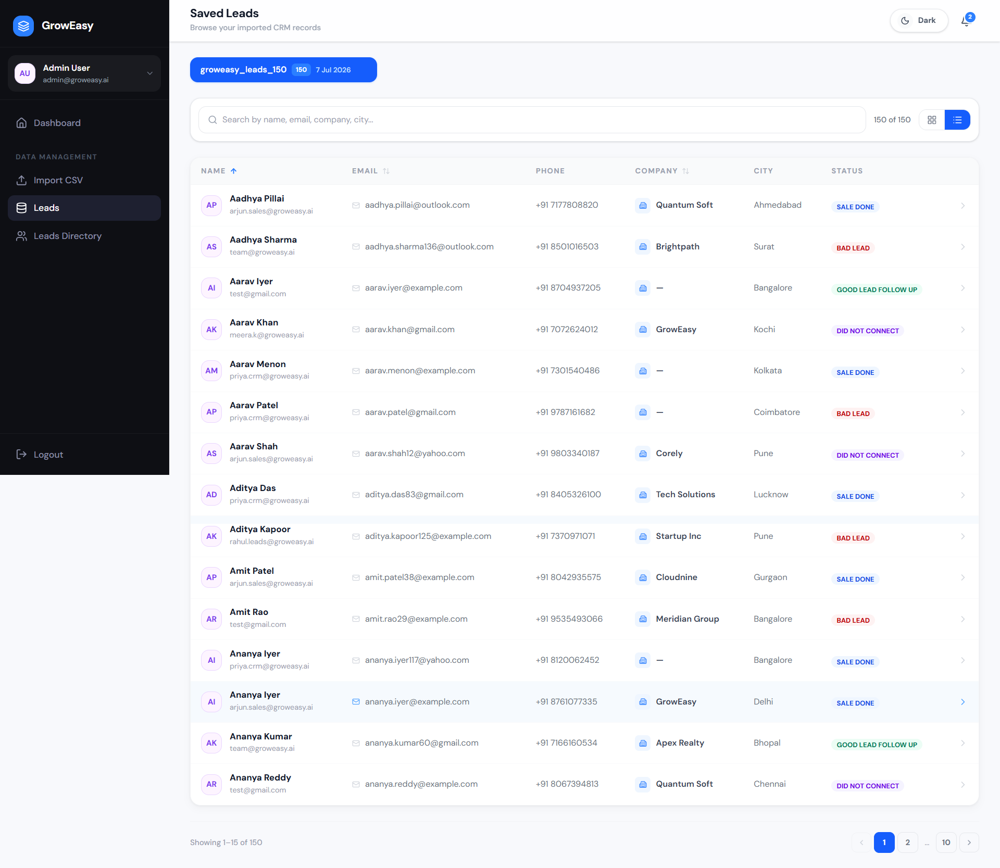
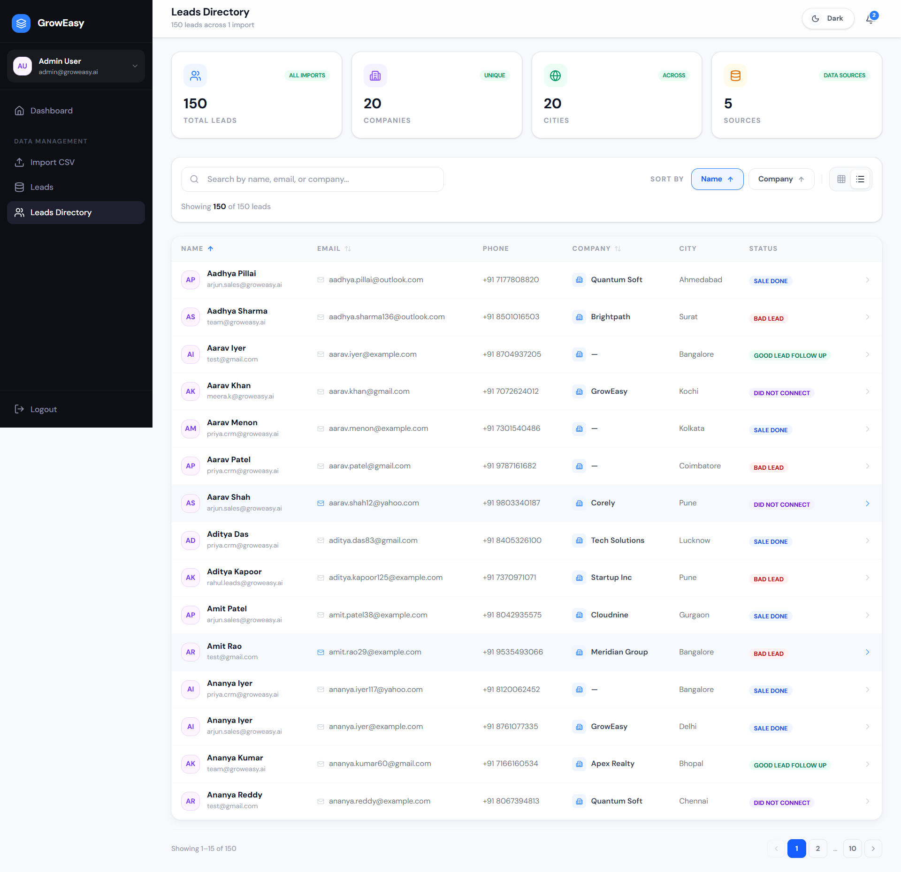

<div align="center">

# GrowEasy

**AI-powered CSV importer for real estate CRM teams**

Upload any lead CSV — any column names. AI maps every row to your CRM schema, deduplicates contacts, and delivers clean records in seconds.

[](https://nextjs.org/)
[](https://expressjs.com/)
[](https://www.typescriptlang.org/)
[](https://tailwindcss.com/)
[](https://ai.google.dev/)
[](https://groq.com/)



</div>

---

## Table of Contents

- [What is GrowEasy?](#what-is-groweasy)
- [Features](#features)
- [Screenshots](#screenshots)
- [Tech Stack](#tech-stack)
- [How It Works](#how-it-works)
- [Project Structure](#project-structure)
- [Getting Started](#getting-started)
- [Environment Variables](#environment-variables)
- [Running Tests](#running-tests)
- [API Reference](#api-reference)
- [CRM Schema](#crm-schema)
- [Sample CSV Files](#sample-csv-files)
- [Deployment Notes](#deployment-notes)
- [License](#license)

---

## What is GrowEasy?

Real estate sales teams receive leads from Facebook Ads, Google Ads, agency spreadsheets, and third-party CRMs — each with different column names and formats. GrowEasy removes the manual mapping step:

1. **Drop a CSV** — any headers, any source
2. **Preview** the raw data before processing
3. **AI maps** each row to a unified 15-field CRM schema
4. **Save & browse** leads on the Dashboard, Leads Directory, or Saved Leads pages

The app supports **light and dark themes**, **grid and table views**, **search & sort**, and **pagination** across all lead views.

---

## Features

| Area | Details |
|:-----|:--------|
| **AI column mapping** | Gemini 2.5 Flash primary; Groq LLaMA 3.3 70B automatic fallback |
| **Resilient processing** | Batches of 20 rows, 2 concurrent, exponential backoff, row-by-row fallback on batch failure |
| **Live import stream** | Server-sent progress events during import (`/api/import/stream`) |
| **Import preview** | Virtualized table of raw CSV before AI runs |
| **Results view** | Summary cards, imported table, expandable skipped-rows panel |
| **Dashboard** | Import folders (5 per row) — click a folder to browse its leads below |
| **Leads Directory** | All saved leads across every import |
| **Saved Leads** | Per-import batch selector with delete |
| **Unified lead cards** | Same expanded card layout everywhere (email, phone, status, company, details drawer) |
| **Pagination** | 12 cards/page in grid, 15 rows/page in table |
| **Data integrity** | Zod validation, email dedup, digits-only phones, skip rows with no email AND no mobile |

---

## Screenshots

### Dashboard — stats, import folders & lead table


### Import CSV — upload & drop zone



### Import complete — summary cards & results table



### Leads Directory — search, sort & paginated table



---

## Tech Stack

### Frontend (`frontend/`)

| Package | Purpose |
|:--------|:--------|
| Next.js 16 (App Router) | Pages, routing, SSR |
| React 19 + TypeScript | UI |
| Tailwind CSS 4 | Styling & dark mode |
| Zustand | Import flow state |
| Framer Motion | Animations |
| PapaParse | Client-side CSV parse |
| TanStack Virtual | Preview table virtualization |
| next-themes | Light / dark toggle |

### Backend (`backend/`)

| Package | Purpose |
|:--------|:--------|
| Express 4 + TypeScript | REST API |
| Google Generative AI | Gemini mapping |
| Groq SDK | Fallback provider |
| PapaParse | Server CSV parse |
| Multer | File uploads |
| Zod | Env + CRM schema validation |

---

## How It Works

```
Browser                         Backend
───────                         ───────
Upload CSV  ──────────────────▶ Parse rows (PapaParse)
Preview raw data                Chunk into batches of 20
Confirm import  ──────────────▶ 2 concurrent AI calls
                                │
                                ├─ Gemini 2.5 Flash (primary)
                                ├─ Groq LLaMA 3.3 (provider fallback)
                                └─ Row-by-row (batch failure fallback)
                                │
                                ◀── SSE progress + final result
Validate + display results      Zod CRM schema per record
Save to localStorage            Skip if no email AND no mobile
Browse in Dashboard / Leads
```

The AI receives raw CSV rows plus a system prompt describing all CRM fields. It returns structured JSON regardless of original column names.

---

## Project Structure

```
groweasy/
├── backend/
│   └── src/
│       ├── config/env.ts           # Zod-validated environment
│       ├── controllers/import.controller.ts
│       ├── routes/import.ts        # POST /api/import, /api/import/stream
│       ├── services/
│       │   ├── ai.service.ts       # Gemini + Groq batching
│       │   ├── csv.service.ts
│       │   └── mapping.service.ts
│       ├── schema/crm.schema.ts    # CRM field definitions
│       └── prompts/extract.prompt.ts
│
├── frontend/
│   ├── app/
│   │   ├── page.tsx                # Dashboard (folders + leads)
│   │   ├── import/page.tsx         # CSV import wizard
│   │   ├── leads/page.tsx          # Saved Leads (per-import batches)
│   │   └── users/page.tsx          # Leads Directory (all leads)
│   ├── components/
│   │   ├── import/                 # DropZone, PreviewTable, ResultTable…
│   │   ├── leads/                  # LeadCard, LeadGrid, LeadTable
│   │   └── ui/                     # Pagination, ThemeToggle…
│   ├── hooks/useImportStream.ts    # SSE import progress
│   └── store/importStore.ts        # Upload → preview → process → done
│
├── docs/screenshots/               # README images
└── samples/                        # Test CSV files
```

---

## Getting Started

### Prerequisites

- **Node.js 20+** and **npm 9+**
- **Google Gemini API key** — [ai.google.dev](https://ai.google.dev/)
- **Groq API key** _(recommended for fallback)_ — [console.groq.com](https://console.groq.com/)

### 1. Clone the repository

```bash
git clone https://github.com/your-username/groweasy.git
cd groweasy
```

### 2. Backend setup

```bash
cd backend
npm install
cp .env.example .env
```

Edit `backend/.env` and add your API keys (see [Environment Variables](#environment-variables)).

```bash
# Development (hot reload on port 3001)
npm run dev
```

Verify the server is running:

```bash
curl http://localhost:3001/api/health
# → {"ok":true,"timestamp":"..."}
```

### 3. Frontend setup

Open a **second terminal**:

```bash
cd frontend
npm install
cp .env.example .env.local
```

`frontend/.env.local` should contain:

```env
NEXT_PUBLIC_API_URL=http://localhost:3001
```

```bash
# Development (port 3000)
npm run dev
```

### 4. Use the app

1. Open **http://localhost:3000**
2. Go to **Import CSV** in the sidebar
3. Upload a file from the `samples/` folder (e.g. `samples/groweasy_leads_150.csv`)
4. Preview → **Confirm & Import** → wait for AI mapping
5. Click **Save Import** to persist leads locally
6. Browse on **Dashboard**, **Leads Directory**, or **Saved Leads**

> **Tip:** Both servers must be running. The frontend talks to the backend at `NEXT_PUBLIC_API_URL`.

### Quick start (both servers)

From the repo root, in two terminals:

```bash
# Terminal 1
cd backend && npm run dev

# Terminal 2
cd frontend && npm run dev
```

### Production build

```bash
# Backend
cd backend && npm run build && npm start

# Frontend
cd frontend && npm run build && npm start
```

---

## Environment Variables

### Backend — `backend/.env`

| Variable | Required | Default | Description |
|:---------|:--------:|:--------|:------------|
| `PORT` | No | `3001` | API server port |
| `GEMINI_API_KEY` | **Yes** | — | Google Gemini API key |
| `GEMINI_MODEL` | No | `gemini-2.5-flash` | Gemini model ID |
| `GROQ_API_KEY` | No | — | Groq key (enables fallback) |
| `GROQ_MODEL` | No | `llama-3.3-70b-versatile` | Groq model ID |
| `AI_BATCH_SIZE` | No | `20` | Rows per AI request |
| `AI_MAX_CONCURRENCY` | No | `2` | Parallel batches |
| `AI_MAX_RETRIES` | No | `3` | Retries before row fallback |
| `ALLOWED_ORIGINS` | No | `*` | Comma-separated CORS origins |

Example:

```env
PORT=3001
GEMINI_API_KEY=AIzaSy...
GROQ_API_KEY=gsk_...
ALLOWED_ORIGINS=http://localhost:3000,https://your-app.vercel.app
```

### Frontend — `frontend/.env.local`

| Variable | Required | Description |
|:---------|:--------:|:------------|
| `NEXT_PUBLIC_API_URL` | **Yes** | Backend base URL (no trailing slash) |

---

## Running Tests

```bash
# Backend unit tests
cd backend && npm test

# Frontend tests
cd frontend && npm test
```

---

## API Reference

### `GET /api/health`

```json
{ "ok": true, "timestamp": "2026-07-07T12:00:00.000Z" }
```

### `POST /api/import`

Import CSV via file upload or JSON body.

**Multipart:** field name `file` (max 10 MB)  
**JSON:** `{ "rows": [{ "Name": "Jane", "Email": "jane@example.com" }] }`

**Response:**

```json
{
  "imported": [ { "name": "Jane", "email": "jane@example.com", "crm_status": "GOOD_LEAD_FOLLOW_UP", "..." : "..." } ],
  "skipped": [ { "rowIndex": 4, "reason": "Missing email and mobile" } ],
  "totals": { "received": 10, "imported": 9, "skipped": 1 }
}
```

### `POST /api/import/stream`

Same input as `/api/import`, but returns **Server-Sent Events** with batch progress, then a final `done` event with the full result. Used by the import UI.

---

## CRM Schema

Every imported record is validated against this schema:

| Field | Type | Notes |
|:------|:-----|:------|
| `name` | string | Full name |
| `email` | string | Lowercased; duplicates noted in `crm_note` |
| `country_code` | string | e.g. `+91` |
| `mobile_without_country_code` | string | Digits only |
| `company` | string | Organisation |
| `city`, `state`, `country` | string | Location |
| `lead_owner` | string | Assigned rep |
| `crm_status` | enum | `GOOD_LEAD_FOLLOW_UP`, `DID_NOT_CONNECT`, `BAD_LEAD`, `SALE_DONE` |
| `crm_note` | string | Notes / alt contacts |
| `data_source` | enum | `leads_on_demand`, `meridian_tower`, `eden_park`, `varah_swamy`, `sarjapur_plots` |
| `possession_time` | string | Timeline |
| `description` | string | Extra details |
| `created_at` | string | Record date |

Rows with **no email and no mobile** are skipped automatically.

---

## Sample CSV Files

| File | Description |
|:-----|:------------|
| `samples/groweasy_leads_150.csv` | Native format, 150 rows |
| `samples/facebook_leads.csv` | Facebook Ads export |
| `samples/google_ads.csv` | Google Ads export |
| `samples/agency_messy.csv` | Inconsistent column names |
| `samples/realestate_crm.csv` | Third-party CRM export |
| `samples/manual_sheet.csv` | Manual spreadsheet |

---

## Deployment Notes

| Service | Suggested host | Config |
|:--------|:---------------|:-------|
| Frontend | Vercel | Set `NEXT_PUBLIC_API_URL` to your API URL |
| Backend | Render / Railway | Set `ALLOWED_ORIGINS` to your Vercel domain |

**CORS:** Set `ALLOWED_ORIGINS` to your production frontend URL. Use `*` only for development or quick demos.

**API keys:** Never commit `.env` files. Use host environment variables in production.

---

## License

MIT License — see [LICENSE](LICENSE) for details.

---

<div align="center">

Built for real estate teams who are tired of manual CSV column mapping.

</div>
